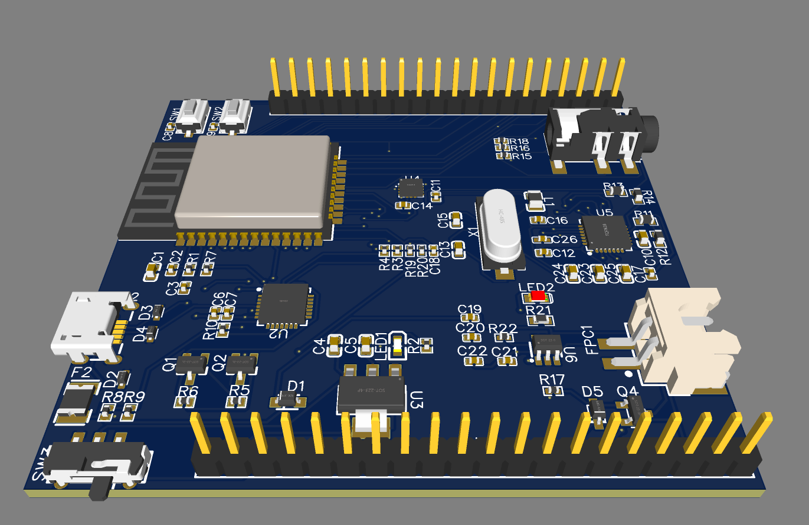
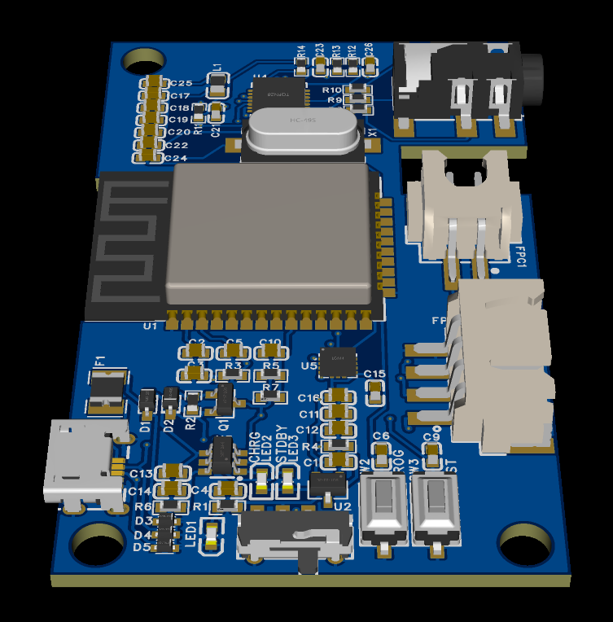

# SCG_box

Arduino based firmware for SCG signal and ECG signal synchronized acquisition device.  
The controller is based on esp32 and runs on a single core, sampling rate reaches nearly 1kHz.  
Send signal via WiFi, support AP mode and station mode, support binary and string mode for sending.   
Includes control and signal acquisition software, (under continuous development). 

[简体中文](./doc/README_zh_CN.md)

## Features

Easy development

+ Based on the ESP32 Arduino library, following the Arduino programming habits
+ Core functions can be called directly

Easy to read form device

+ Data can be sent in binary or as strings directly, easy to read by the host
+ Data stored as an array, easy for further development

## Hardware Design
V0.1  
  
V1.0_beta  
  

## Directory Contents

| Directory             | Description                                   |
| --------------------- | --------------------------------------------- |
| ``/doc``              | Documentation related files                   |
| ``/scg_box_firmware`` | Current SCG box firmware                      |
| ``/src_matlab``       | Matlab-based control and acquisition programs |
| ``/src_qt``           | Qt-based control and acquisition programs     |

## Tutorials[WIP]
[1.Uploading firmware](./doc/upload.md)  
[2.Further development](./doc/dev.md)  

## Change Log
[Change Log](./doc/CHANGELOG_zh_CN.md)
